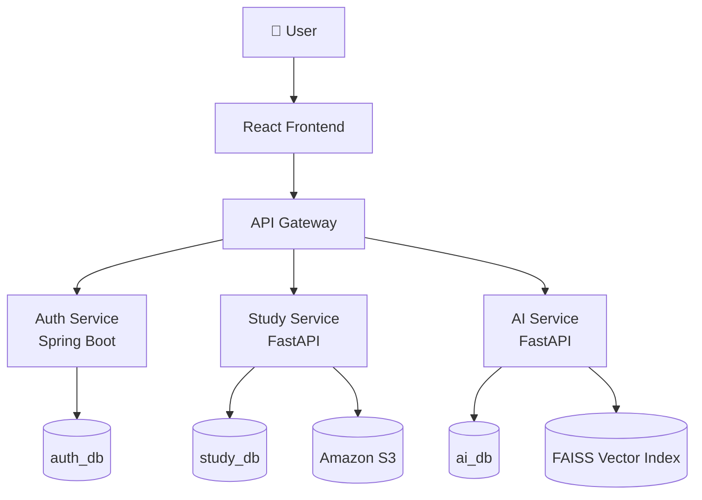
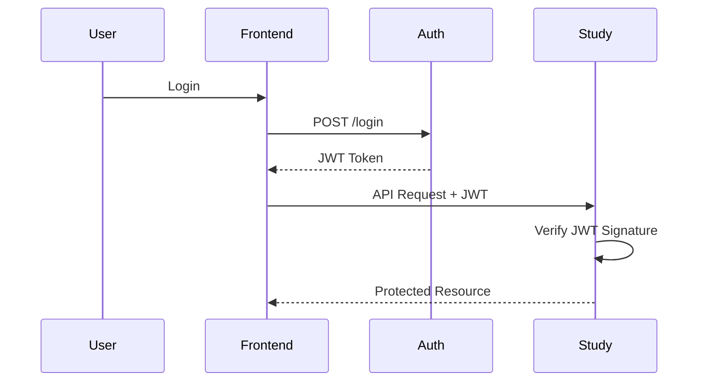
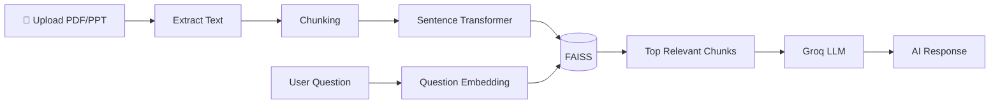
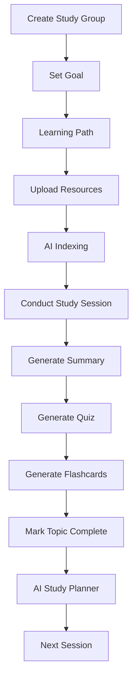
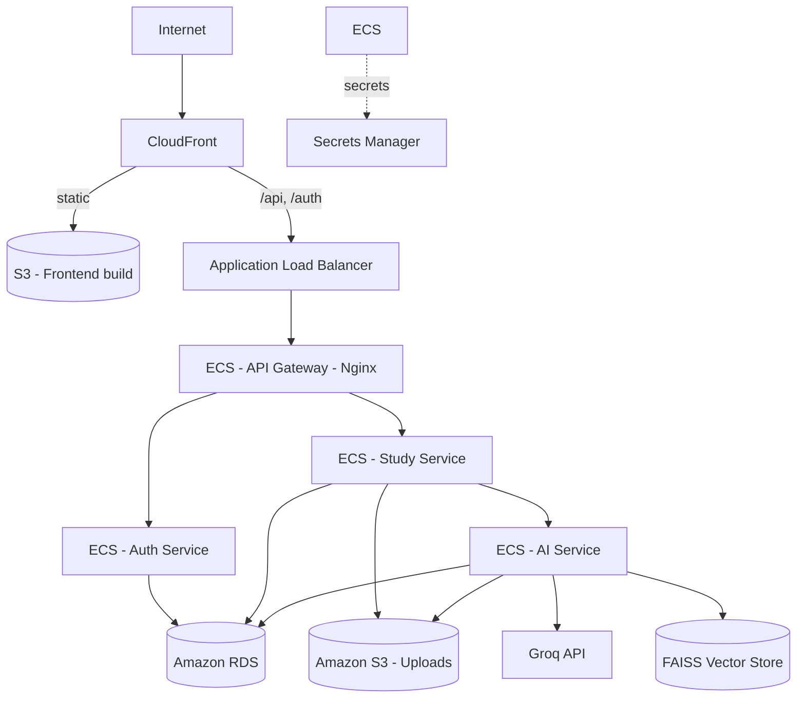
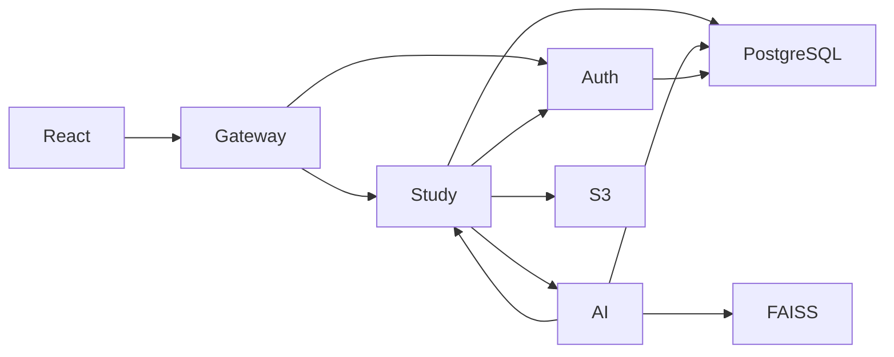

# StudyFlow AI

StudyFlow AI is an AI-powered collaborative learning platform. The platform allows organizers to create study groups, upload learning resources, conduct study sessions, and use AI to assist members.

## 1. Project Overview
StudyFlow AI is a robust microservices platform that provides a complete end-to-end learning lifecycle—from goal setting and path creation, to resource indexing, AI assistance, and session planning.

## 2. Features
- Group collaboration and management.
- Dynamic Learning Path tracking.
- Resource uploading and management.
- AI Document Indexing (FAISS) for Retrieval-Augmented Generation (RAG).
- AI-driven study sessions, quizzes, and flashcards.
- Real-time updates and notifications.

## 3. Tech Stack
- **Frontend**: React, TypeScript, Vite, Tailwind CSS
- **API Gateway**: Nginx
- **Auth Service**: Spring Boot, Spring Security, JWT (HttpOnly cookies)
- **Study Service**: FastAPI
- **AI Service**: FastAPI, FAISS, Sentence-Transformers (all-MiniLM-L6-v2), Groq API (llama-3.1-8b-instant)
- **Database**: PostgreSQL (Amazon RDS)
- **Infrastructure**: Docker, Terraform, AWS (ECS Fargate, ALB, RDS, S3, CloudFront, ECR, Secrets Manager, Cloud Map)

## 4. AI Agents Architecture

StudyFlow AI is powered by four specialized, decoupled AI agents that operate seamlessly behind the scenes. Users interact naturally with the application while the system intelligent routes tasks to the appropriate agent:

1. **📝 Resource Manager Agent**: Autonomously processes uploaded documents (PDF/DOCX), performs chunking, embedding, and FAISS vector indexing, and tracks processing status.
2. **📚 RAG Assistant Agent**: Handles the conversational interface, managing chat history, refining queries, and synthesizing answers with citations from the indexed study materials.
3. **📅 Scheduler Agent**: Analyzes the group's learning path, past sessions, and available resources to generate structured, balanced study agendas and time allocations.
4. **👥 Group Coordinator Agent**: Silently manages the group's lifecycle by tracking attendance, monitoring learning path progress, generating session summaries, creating quizzes/flashcards, and sending targeted notifications.

## 5. System Architecture

### 🏗️ Overall System Architecture



### 🔐 Authentication Flow



### 🤖 Retrieval-Augmented Generation (RAG)



### 📚 Learning Workflow



### ☁️ AWS Deployment Architecture

The frontend and API are served from a single CloudFront origin: static assets
come from S3, while `/api/*` and `/auth/*` are routed to the ALB. This keeps the
whole app on one HTTPS origin, so the `Secure`, `SameSite=Lax` session cookie
works without a custom domain or CORS.



### 🔌 Microservices Communication



## 6. Folder Structure
- `frontend/` - React frontend application.
- `auth-service/` - Spring Boot authentication service.
- `study-service/` - FastAPI study service.
- `ai-service/` - FastAPI AI service.
- `api-gateway/` - Nginx API Gateway routing.
- `terraform/` - Infrastructure as Code (modules + environments).
- `scripts/` - Deployment helper scripts.

## 7. Local Development (Docker)

The whole stack runs locally with Docker Compose.

```bash
# 1. Create a .env at the repo root (see Environment Variables below)
# 2. Start Postgres + all services
docker compose up --build

# Frontend dev server (separate terminal)
cd frontend && npm install && npm run dev
```

Services (local):
- Frontend (Vite): http://localhost:5173
- API Gateway (Nginx): http://localhost:8000
- Auth Service: http://localhost:8080
- Study Service: http://localhost:8081
- AI Service: http://localhost:8002

## 8. Environment Variables

Set at the repo root `.env` (git-ignored). Required keys:

| Variable | Purpose |
| --- | --- |
| `POSTGRES_USER` / `POSTGRES_PASSWORD` / `POSTGRES_DB` | Database credentials |
| `JWT_SECRET` | Signing key shared by auth + study services |
| `INTERNAL_API_KEY` | Shared secret for service-to-service calls |
| `GROQ_API_KEY` | Groq API key for the AI service |
| `GROQ_MODEL` | Groq model id (e.g. `llama-3.1-8b-instant`) |

In AWS these are injected from **Secrets Manager**, never hardcoded.

## 9. AWS Deployment (Terraform)

Infrastructure lives under `terraform/` (modules + `environments/dev`). Images are
built and pushed to ECR, then ECS services run them behind the ALB; the frontend
is built and synced to S3 behind CloudFront.

```bash
# Provision / update infrastructure
cd terraform/environments/dev
terraform init
terraform apply

# Redeploy the frontend (build -> S3 -> CloudFront invalidation)
bash scripts/deploy-frontend.sh
```

## 10. Future Roadmap
- Custom domain + HTTPS on CloudFront (Route 53 / ACM modules are scaffolded).
- AI recommendations for next topics.
- Drag & drop roadmap reorganization.
- Progress analytics and insights.
- CI/CD-driven deploys.
