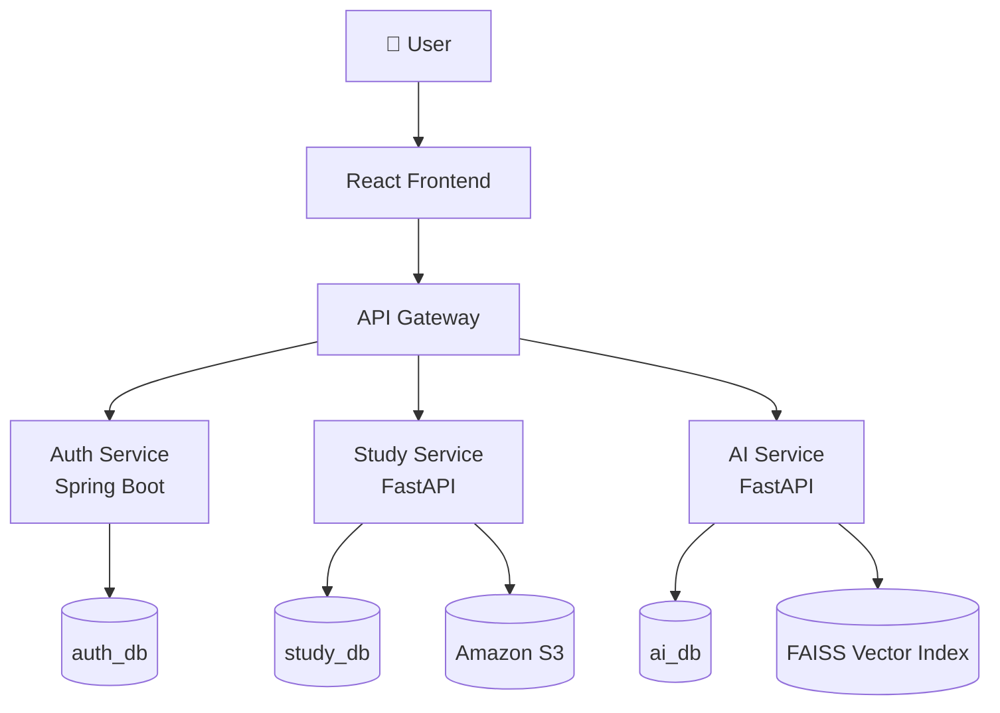
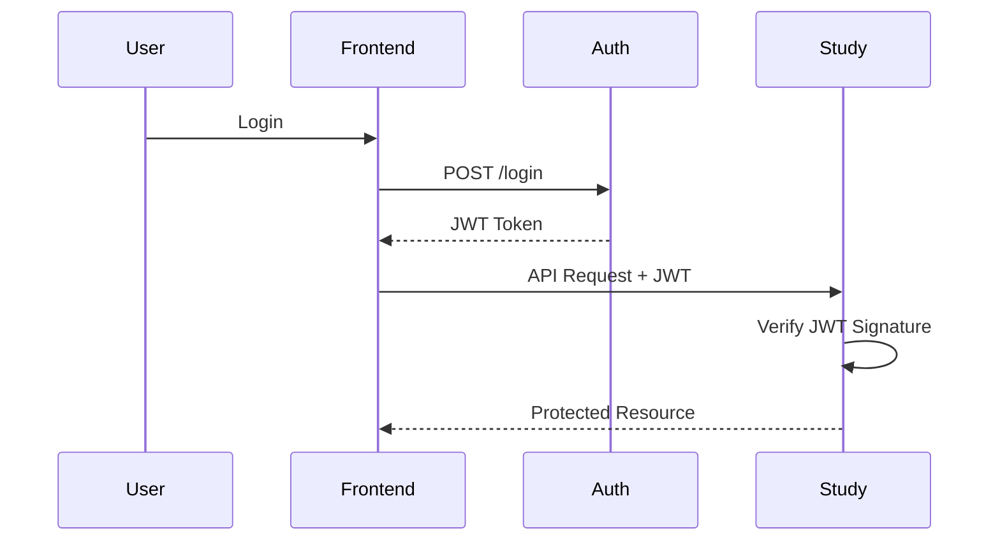
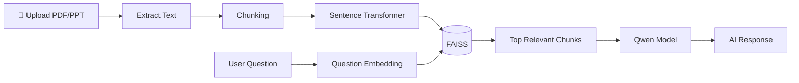
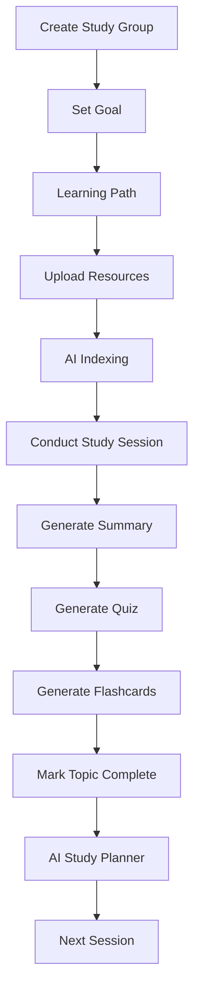
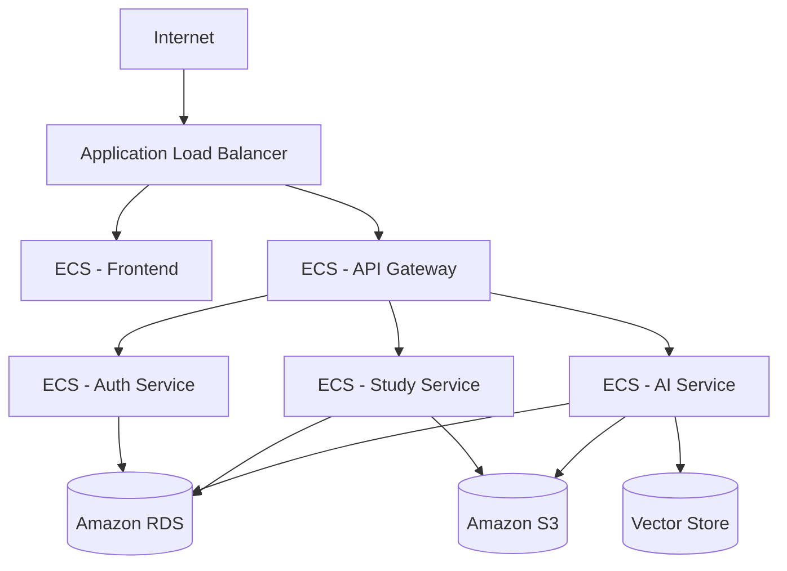
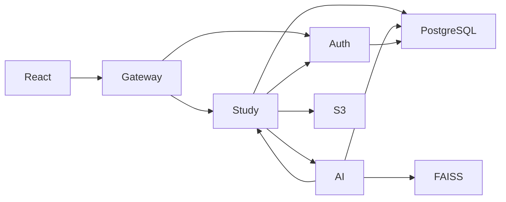

# StudyFlow AI

StudyFlow AI is an AI-powered collaborative learning platform. The platform allows organizers to create study groups, upload learning resources, conduct study sessions, and use AI to assist members.

## 1. Project Overview
StudyFlow AI is a robust microservices platform that provides a complete end-to-end learning lifecycle—from goal setting and path creation, to resource indexing, AI assistance, and session planning.

## 2. Features
- Group collaboration and management.
- Dynamic Learning Path tracking.
- Resource uploading and management.
- AI Document Indexing (FAISS) for Retrieval-Augmented Generation (RAG).
- AI-driven study sessions, quizzes, and flashcards.
- Real-time updates and notifications.

## 3. Tech Stack
- **Frontend**: React, TypeScript, Tailwind CSS, shadcn/ui
- **API Gateway**: Nginx
- **Auth Service**: Spring Boot, Spring Security, JWT
- **Study Service**: FastAPI
- **AI Service**: FastAPI, LangChain, LangGraph, FAISS, Ollama, Qwen3
- **Database**: PostgreSQL
- **Infrastructure**: Docker, AWS (ECS, ALB, RDS, S3)

## 4. Architecture

### 🏗️ Overall System Architecture

### 🔐 Authentication Flow

### 🤖 Retrieval-Augmented Generation (RAG)

### 📚 Learning Workflow

### ☁️ AWS Deployment Architecture

### 🔌 Microservices Communication

## 5. Folder Structure
- `frontend/` - React frontend application.
- `auth-service/` - Spring Boot authentication service.
- `study-service/` - FastAPI study service.
- `ai-service/` - FastAPI AI service.
- `api-gateway/` - Nginx API Gateway routing.

## 6. Installation
*(To be completed)*

## 7. Local Development
*(To be completed)*

## 8. Environment Variables
*(To be completed)*

## 9. Docker Setup
*(To be completed)*

## 10. Terraform Deployment
*(To be completed)*

## 11. Screenshots
*(To be completed)*

## 12. Future Roadmap
- AI Recommendations for next topics.
- Drag & Drop roadmap reorganization.
- Progress analytics and insights.
- AWS Production Deployment.
