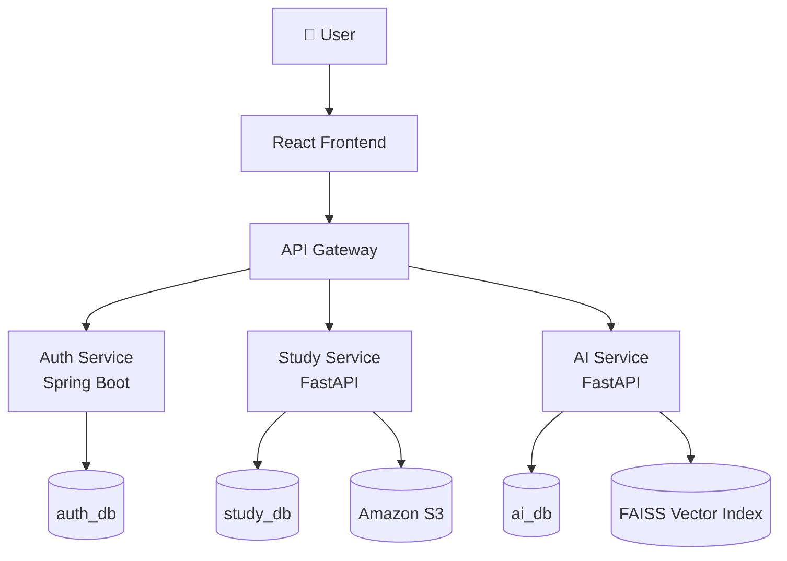
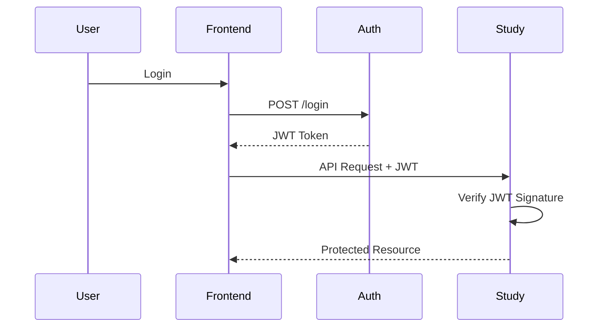
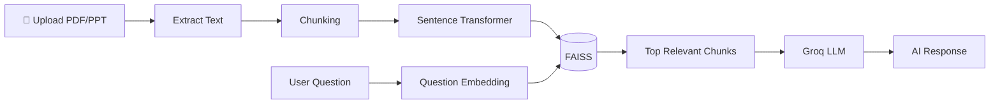
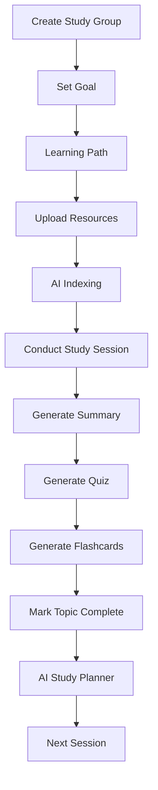
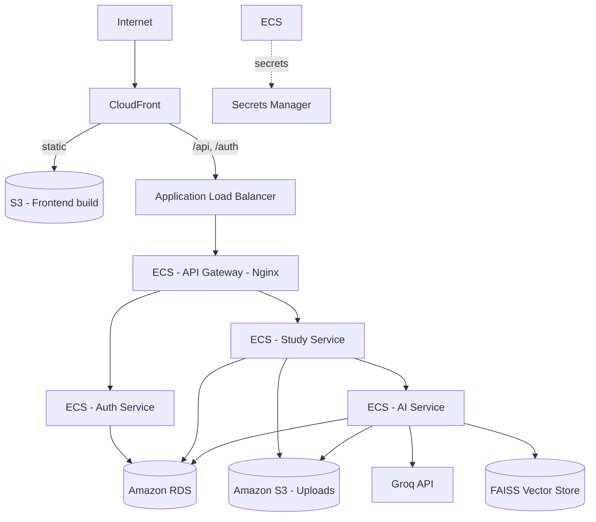
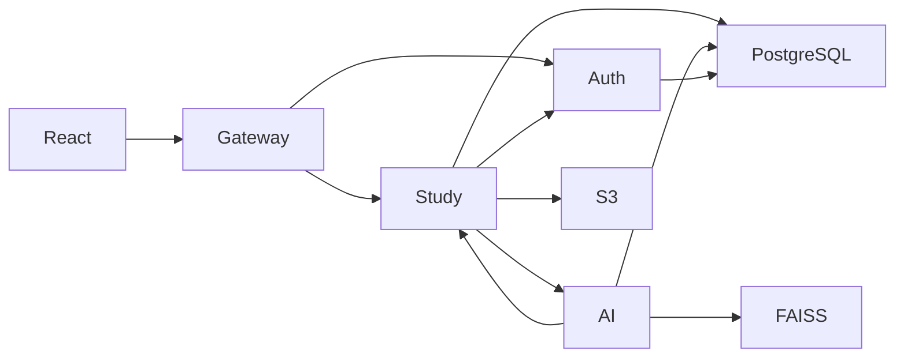

# StudyFlow AI

StudyFlow AI is an AI-powered collaborative learning platform. The platform allows organizers to create study groups, upload learning resources, conduct study sessions, and use AI to assist members.

## 1. Project Overview
StudyFlow AI is a robust microservices platform that provides a complete end-to-end learning lifecycle—from goal setting and path creation, to resource indexing, AI assistance, and session planning.

## 2. Features
- **Study groups** with invite codes. Only the organizer sees and shares the code; members join with it.
- **Learning path** per group, with progress tracking.
- **Library**: upload PDF notes (up to 25 MB each). Each file is chunked, embedded and indexed for its group.
- **Ask AI**: answers come only from the group's notes, with the file and page each answer came from.
- **AI study planner**: proposes the next session with an agenda; an organizer approves it before it is created.
- **After a session**: AI summary, a graded quiz with explanations, and flashcards.
- **Notifications**, global search (Ctrl K), light and dark themes, a 25-second product tour and a Guide page.

## 3. Tech Stack
- **Frontend**: React, TypeScript, Vite, Tailwind CSS
- **API Gateway**: Nginx
- **Auth Service**: Spring Boot, Spring Security, JWT (HttpOnly cookies)
- **Study Service**: FastAPI
- **AI Service**: FastAPI, FAISS, Sentence-Transformers (all-MiniLM-L6-v2), Groq API (openai/gpt-oss-20b)
- **Database**: PostgreSQL (Amazon RDS)
- **Infrastructure**: Docker, Terraform, AWS (ECS Fargate, ALB, RDS, S3, CloudFront, ECR, Secrets Manager, Cloud Map)

## 4. AI Agents Architecture

StudyFlow AI is powered by four specialized, decoupled AI agents that operate seamlessly behind the scenes. Users interact naturally with the application while the system intelligent routes tasks to the appropriate agent:

1. **📝 Resource Manager Agent**: Autonomously processes uploaded PDF documents, performs chunking, embedding, and FAISS vector indexing, and tracks processing status.
2. **📚 RAG Assistant Agent**: Handles the conversational interface, managing chat history, refining queries, and synthesizing answers with citations from the indexed study materials.
3. **📅 Scheduler Agent**: Analyzes the group's learning path, past sessions, and available resources to generate structured, balanced study agendas and time allocations.
4. **👥 Group Coordinator Agent**: Silently manages the group's lifecycle by tracking attendance, monitoring learning path progress, generating session summaries, creating quizzes/flashcards, and sending targeted notifications.

## 5. System Architecture

### 🏗️ Overall System Architecture


```mermaid
flowchart TD
    U[👤 User] --> F[React Frontend]
    F --> G[API Gateway]
    G --> A[Auth Service<br/>Spring Boot]
    G --> S[Study Service<br/>FastAPI]
    G --> AI[AI Service<br/>FastAPI]
    A --> AUTHDB[(auth_db)]
    S --> STUDYDB[(study_db)]
    AI --> AIDB[(ai_db)]
    AI --> FAISS[(FAISS Vector Index)]
    S --> S3[(Amazon S3)]
```

### 🔐 Authentication Flow


```mermaid
sequenceDiagram
    participant User
    participant Frontend
    participant Auth
    participant Study
    User->>Frontend: Login
    Frontend->>Auth: POST /login
    Auth-->>Frontend: JWT Token
    Frontend->>Study: API Request + JWT
    Study->>Study: Verify JWT Signature
    Study-->>Frontend: Protected Resource
```

### 🤖 Retrieval-Augmented Generation (RAG)


```mermaid
flowchart LR
    PDF[📄 Upload PDF/PPT] --> Extract[Extract Text]
    Extract --> Chunk[Chunking]
    Chunk --> Embed[Sentence Transformer]
    Embed --> FAISS[(FAISS)]
    User[User Question] --> QueryEmbedding[Question Embedding]
    QueryEmbedding --> FAISS
    FAISS --> Context[Top Relevant Chunks]
    Context --> Groq[Groq LLM]
    Groq --> Answer[AI Response]
```

### 📚 Learning Workflow


```mermaid
flowchart TD
    Group[Create Study Group]
    Group --> Goal[Set Goal]
    Goal --> Roadmap[Learning Path]
    Roadmap --> Upload[Upload Resources]
    Upload --> AIIndex[AI Indexing]
    AIIndex --> Session[Conduct Study Session]
    Session --> Summary[Generate Summary]
    Summary --> Quiz[Generate Quiz]
    Quiz --> Flashcards[Generate Flashcards]
    Flashcards --> Complete[Mark Topic Complete]
    Complete --> Planner[AI Study Planner]
    Planner --> NextSession[Next Session]
```

### ☁️ AWS Deployment Architecture

The frontend and API are served from a single CloudFront origin: static assets
come from S3, while `/api/*` and `/auth/*` are routed to the ALB. This keeps the
whole app on one HTTPS origin, so the `Secure`, `SameSite=Lax` session cookie
works without a custom domain or CORS.


```mermaid
flowchart TD
    Internet --> CF[CloudFront]
    CF -->|static| S3FE[(S3 - Frontend build)]
    CF -->|/api, /auth| ALB[Application Load Balancer]
    ALB --> GW[ECS - API Gateway - Nginx]
    GW --> AUTH[ECS - Auth Service]
    GW --> STUDY[ECS - Study Service]
    STUDY --> AI[ECS - AI Service]
    AUTH --> RDS[(Amazon RDS)]
    STUDY --> RDS
    AI --> RDS
    STUDY --> S3[(Amazon S3 - Uploads)]
    AI --> S3
    AI --> GROQ[Groq API]
    AI --> FAISS[(FAISS Vector Store)]
    ECS -.secrets.-> SM[Secrets Manager]
```

### 🔌 Microservices Communication


```mermaid
flowchart LR
    React --> Gateway
    Gateway --> Auth
    Gateway --> Study
    Study --> AI
    AI --> Study
    Study --> Auth
    Study --> PostgreSQL
    AI --> PostgreSQL
    Auth --> PostgreSQL
    Study --> S3
    AI --> FAISS
```

## 6. Reliability and Safety

- **Guardrails on every LLM call**: prompt-injection blocking on chat, and PII masking (emails, Aadhaar numbers, Indian mobile numbers) applied in the single `generate_answer` choke point, so summaries, quizzes, flashcards and plans are covered too. Prompts and model output are not logged.
- **Grounding**: every substantive sentence of an Ask AI answer must be supported by a retrieved chunk, otherwise the answer is replaced. Answers too short to check are shown without citations.
- **Generation jobs carry a lease** (`started_at`). Jobs orphaned by a crash or restart are marked FAILED after 10 minutes (at startup and on read, with a conditional update), so the UI offers "Try again" instead of spinning forever.
- **FAISS indexes**: writes and reads take a per-group lock (a Postgres advisory lock across processes and replicas); files are written atomically. With S3 enabled, each write publishes an immutable versioned snapshot behind a `current.json` pointer, so replicas never mix files from two versions.
- **MCP study plans** are stored in `ai_db`, so they survive restarts and are shared between replicas.
- **Groq**: one retry after a rate limit (honouring `Retry-After`, capped at 10 s) and a completion budget large enough for JSON outputs.
- **Auth**: HttpOnly JWT cookie that expires with the token (24 h), 10 s clock-skew leeway, 409 on duplicate sign-up, and validation errors that never echo submitted data.

## 7. Performance

Measured with k6 against the production Docker Compose stack on a single laptop (16 cores, shared with the load generator). Each virtual user loads the dashboard (`/auth/me`, groups, unread count) and then reads for 3 to 7 seconds:

| Concurrent users | Median | p95 | Errors |
| --- | --- | --- | --- |
| 400 | 9 ms | 18 ms | 0% |
| 800 | 11 ms | 43 ms | 0% |
| 1,200 | 58 ms | 1.1 s | 0% |
| 1,600 | 1.6 s | 2.6 s | 0% |

Two bottlenecks were found and fixed during testing: the nginx gateway capped at about 500 requests in flight (`worker_connections 1024`), and study-service ran one Python worker that saturated a CPU core. It now runs 4 workers (`UVICORN_WORKERS`).

AI features are limited by the Groq account, not by these servers: chat, summaries, quizzes and plans share the model's per-minute and per-day request and token quotas. Treat these numbers as a local baseline; load-test the deployed stack before quoting capacity.

## 8. Testing

- `ai-service`: 200+ pytest tests (guardrails, grounding, agents, MCP, FAISS locking and S3 snapshots, PII on every LLM call, event-loop blocking).
- `study-service`: pytest tests (transactions, job leases, invite-code visibility, UTC timestamps, JWT leeway).
- Offline RAG eval (`python -m evals.rag_eval`, add `--live` for Groq): decision recall 14/15, faithfulness 15/15, not-in-notes 5/5.
- Frontend: `npm run lint` (oxlint plus a colour-token guard) and `npm run walkthrough`, a Playwright end-to-end run in light, dark and 390 px.

## 9. Folder Structure
- `frontend/` - React frontend application.
- `auth-service/` - Spring Boot authentication service.
- `study-service/` - FastAPI study service.
- `ai-service/` - FastAPI AI service.
- `api-gateway/` - Nginx API Gateway routing.
- `terraform/` - Infrastructure as Code (modules + environments).
- `scripts/` - Deployment helper scripts.

## 10. Local Development (Docker)

The whole stack runs locally with Docker Compose.

```bash
# 1. Create a .env at the repo root (see Environment Variables below)
# 2. Start Postgres + all services
docker compose up --build

# Frontend dev server (separate terminal)
cd frontend && npm install && npm run dev
```

Services (local):
- Frontend (Vite): http://localhost:5173
- API Gateway (Nginx): http://localhost:8000
- Auth Service: http://localhost:8080
- Study Service: http://localhost:8081
- AI Service: http://localhost:8002

## 11. Environment Variables

Set at the repo root `.env` (git-ignored). Required keys:

| Variable | Purpose |
| --- | --- |
| `POSTGRES_USER` / `POSTGRES_PASSWORD` / `POSTGRES_DB` | Database credentials |
| `JWT_SECRET` | Signing key shared by auth + study services |
| `INTERNAL_API_KEY` | Shared secret for service-to-service calls |
| `GROQ_API_KEY` | Groq API key for the AI service |
| `GROQ_MODEL` | Groq model id (e.g. `openai/gpt-oss-20b`) |
| `GROQ_API_KEY1`, `GROQ_API_KEY2` | Optional fallback Groq keys, used when a key is rate-limited or rejected |
| `APP_BASE_URL` | Public origin of the frontend, used in password-reset links. **Set it to the deployed HTTPS origin** (e.g. `https://studyflow.example.com`); the default `http://localhost` only works locally |
| `SMTP_HOST`, `SMTP_PORT`, `SMTP_USER`, `SMTP_PASSWORD`, `MAIL_FROM` | Email for password resets (e.g. Gmail: `smtp.gmail.com`, `587`, your address, an App Password). With `SMTP_HOST` empty, reset requests still succeed but no email is sent |

In AWS these are injected from **Secrets Manager**, never hardcoded.

## 12. AWS Deployment (Terraform)

Infrastructure lives under `terraform/` (modules + `environments/dev`). Images are
built and pushed to ECR, then ECS services run them behind the ALB; the frontend
is built and synced to S3 behind CloudFront.

```bash
# Provision / update infrastructure
cd terraform/environments/dev
terraform init
terraform apply

# Redeploy the frontend (build -> S3 -> CloudFront invalidation)
bash scripts/deploy-frontend.sh
```

## 13. Roadmap
- **Professional mode**: choose student or professional at sign-up; the UI uses workplace language (Teams, Meetings, Roadmap) and the AI writes for that audience. Designed, not yet built.
- **Meeting minutes**: upload a meeting transcript or recording (transcribed with Groq Whisper); the AI writes minutes with decisions, action items and open questions, labelled with their source. Designed, not yet built.
- **More file types**: DOCX, PPTX and Markdown extraction, and OCR for scanned PDFs (today only text-based PDFs are indexed).
- **Study session coach**: store quiz scores so the planner can target weak topics and attach relevant notes.
- **Durable job queue** so crashed generation jobs re-run automatically instead of waiting for a manual retry.
- Custom domain + HTTPS on CloudFront (Route 53 / ACM modules are scaffolded).
