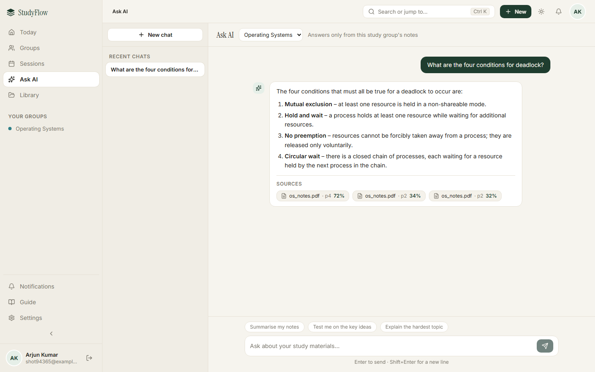
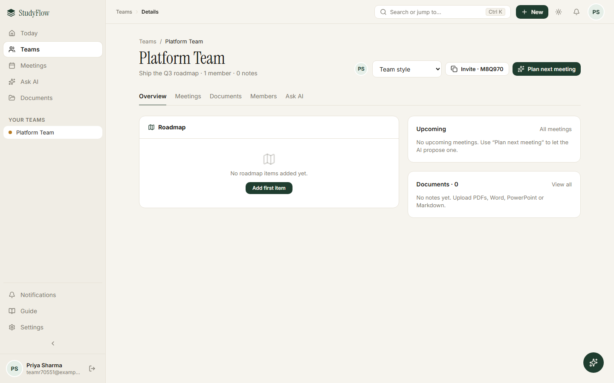
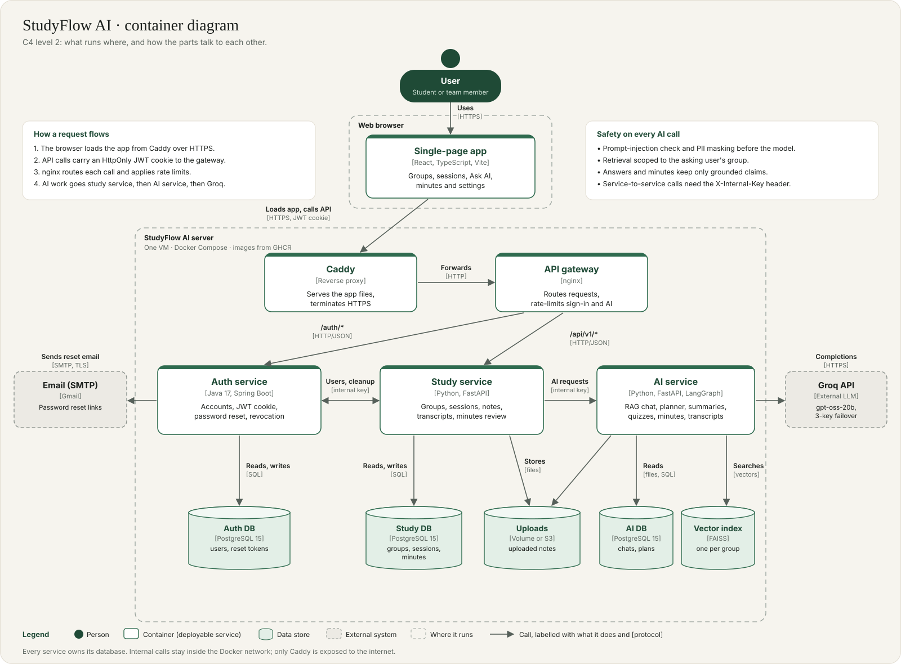
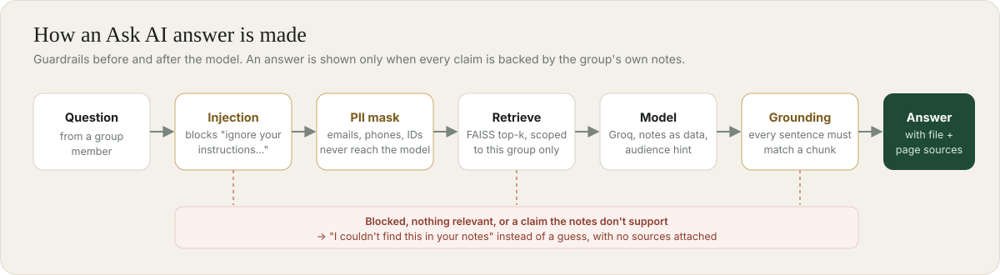

# StudyFlow AI

StudyFlow AI is a collaborative learning platform for study groups and work teams. An organizer creates a group, shares an invite code, and uploads notes. Members ask questions that are answered only from those notes, plan sessions with an AI planner, and revise with summaries, quizzes and flashcards.

The same product works for students and professionals: switch the account type and the interface talks about teams, meetings and roadmaps, while the AI writes for a workplace audience.

## Demo

<!-- To play the video inline on GitHub: edit this README on github.com, drag docs/media/studyflow-demo.mp4
     into the editor, and replace this comment with the user-attachments link GitHub generates. -->

[Watch the 2-minute walkthrough](docs/media/studyflow-demo.mp4): an organizer creates a group and uploads notes, a professional joins with the invite code, then Ask AI, the session planner, a summary, a quiz, flashcards and settings.

| Ask AI, with the file and page behind each answer | The same group in professional mode |
| --- | --- |
|  |  |

## Features

- **Groups with invite codes.** Only the organizer sees and shares the code; members join with it.
- **Student and professional modes.** Each user picks an account type at sign-up and can change it in Settings. Each group also has an audience, so a team keeps its own wording for every member.
- **Learning path** per group, with progress tracking.
- **Library.** Upload PDF, Word (.docx), PowerPoint (.pptx), Markdown or plain-text notes, up to 25 MB each. Each file is chunked, embedded and indexed for its group only.
- **Ask AI.** Answers come only from the group's notes and show the file and page they came from. If the notes don't cover a question, it says so instead of guessing.
- **AI session planner.** Proposes the next session with a timed agenda; the organizer reviews it before it is created.
- **After a session:** an AI summary, a graded quiz with explanations, and flashcards.
- **Accounts that behave like a real product:** change password (other sessions are signed out), reset a forgotten password by email (one-time links that expire after 30 minutes), notification preferences per category, and account deletion that also removes your AI chat history.
- Notifications, global search (Ctrl K), light and dark themes, a short product tour and a Guide page.

## Architecture



- **Frontend:** React, TypeScript, Vite, Tailwind CSS.
- **Gateway:** nginx routes `/auth/*` to the auth service and `/api/v1/*` to the study service, with rate limits on sign-in, sign-up and AI calls.
- **Auth service:** Spring Boot, Spring Security, Flyway. Issues a JWT in an HttpOnly cookie and owns accounts, password resets and token revocation.
- **Study service:** FastAPI, SQLAlchemy, Alembic. Owns groups, sessions, notes, quizzes, flashcards and notifications, and calls the AI service with an internal key.
- **AI service:** FastAPI, LangGraph agents, MCP tools, FAISS, Sentence-Transformers (`all-MiniLM-L6-v2`) and the Groq API (`openai/gpt-oss-20b`).
- **Data:** PostgreSQL 15, with a separate database per service.

### AI agents

| Agent | What it does |
| --- | --- |
| Resource manager | Extracts text from uploaded notes, chunks and embeds it, and maintains the group's FAISS index. |
| RAG assistant | Answers Ask AI questions from the group's notes, keeps chat history, and attaches sources. |
| Scheduler | Reads the learning path, past sessions and available notes, and drafts a balanced session agenda. |
| Group coordinator | Writes session summaries, quizzes and flashcards, and tracks progress. |

### How an answer is made



## Reliability and safety

- **Guardrails on every model call.** Ask AI blocks prompt-injection attempts. PII masking (emails, Aadhaar numbers, Indian mobile numbers) runs in the single `generate_answer` choke point, so summaries, quizzes, flashcards and plans are covered too. Prompts and model output are not logged.
- **Grounding.** Every substantive sentence of an Ask AI answer must be supported by a retrieved chunk, otherwise the answer is replaced.
- **Generation jobs carry a lease.** Jobs orphaned by a crash or restart are marked failed after 10 minutes, so the UI offers "Try again" instead of spinning forever.
- **FAISS indexes** take a per-group Postgres advisory lock across processes and replicas, and are written atomically. With S3 enabled, each write publishes an immutable versioned snapshot behind a `current.json` pointer.
- **Groq:** one retry after a rate limit (honouring `Retry-After`, capped at 10 s), then failover to the next configured API key.
- **Auth:** HttpOnly cookie that expires with the token (24 h), password-reset tokens stored only as SHA-256 hashes and consumed atomically, and older sessions revoked after a password change or reset.
- **Model output is normalised before it is saved.** For example, agenda activity types the model invents ("lecture", "exercise") are mapped to the ones the app knows instead of failing the plan.

## Performance

Measured with k6 against the production Docker Compose stack on one laptop (16 cores, shared with the load generator). Each virtual user loads the dashboard and then reads for 3 to 7 seconds:

| Concurrent users | Median | p95 | Errors |
| --- | --- | --- | --- |
| 400 | 9 ms | 18 ms | 0% |
| 800 | 11 ms | 43 ms | 0% |
| 1,200 | 58 ms | 1.1 s | 0% |
| 1,600 | 1.6 s | 2.6 s | 0% |

Two bottlenecks were found and fixed during testing: the nginx gateway capped at about 500 requests in flight (now `worker_connections 8192`), and the study service ran one Python worker that saturated a CPU core (now 4 workers, `UVICORN_WORKERS`).

AI features are limited by the Groq account, not by these servers: chat, summaries, quizzes and plans share the model's per-minute and per-day quotas. Treat these numbers as a local baseline.

## Testing

- `auth-service`: 28 JUnit tests (sign-up, cookies, password change and reset, revocation, account deletion).
- `study-service`: 67 pytest tests (transactions, job leases, invite-code visibility, audiences, notification preferences, upload types).
- `ai-service`: 226 pytest tests (guardrails, grounding, agents, MCP, FAISS locking and S3 snapshots, document loaders, key failover).
- Offline RAG eval (`python -m evals.rag_eval`, add `--live` for Groq): decision recall 14/15, faithfulness 15/15, not-in-notes 5/5.
- Frontend: `npm run lint` (oxlint plus colour-token and wording guards), `npm run walkthrough` (Playwright end to end in light, dark and 390 px) and `npm run walkthrough:modes` (25 checks across student and professional modes).

## Folder structure

- `frontend/` - React frontend.
- `auth-service/` - Spring Boot authentication service.
- `study-service/` - FastAPI study service.
- `ai-service/` - FastAPI AI service.
- `api-gateway/` - nginx gateway.
- `deploy/` - Caddyfile, VM bootstrap, deploy and backup scripts.
- `terraform/` - AWS infrastructure as code (alternative deployment).
- `scripts/` - seed data and smoke tests.

## Local development

```bash
# 1. Create a .env at the repo root (see Environment variables below)
# 2. Start Postgres and all services
docker compose up --build

# Frontend dev server (separate terminal)
cd frontend && npm install && npm run dev
```

Services:
- Frontend (Vite): http://localhost:5173
- Gateway (nginx): http://localhost:8000
- Auth service: http://localhost:8080
- Study service: http://localhost:8081
- AI service: http://localhost:8002

## Environment variables

Set in the repo root `.env` (git-ignored):

| Variable | Purpose |
| --- | --- |
| `POSTGRES_USER` / `POSTGRES_PASSWORD` / `POSTGRES_DB` | Database credentials |
| `JWT_SECRET` | Signing key shared by the auth and study services |
| `INTERNAL_API_KEY` | Shared secret for service-to-service calls |
| `GROQ_API_KEY` | Groq API key for the AI service |
| `GROQ_API_KEY1`, `GROQ_API_KEY2` | Optional fallback Groq keys, used when a key is rate-limited or rejected |
| `GROQ_MODEL` | Groq model id (default `openai/gpt-oss-20b`) |
| `APP_BASE_URL` | Public origin of the frontend, used in password-reset links. Production defaults to the deployed site; set `http://localhost` for local runs |
| `SMTP_HOST`, `SMTP_PORT`, `SMTP_USER`, `SMTP_PASSWORD`, `MAIL_FROM` | Email for password resets (for Gmail: `smtp.gmail.com`, `587`, your address and an App Password). With `SMTP_HOST` empty, reset requests still succeed but no email is sent |

## Deployment

Production runs on a single Oracle Cloud VM. Pushing to `main` runs the tests, builds the four service images to GHCR, copies the compose files and the frontend build to the VM over SSH, and restarts the stack. Caddy serves the frontend and terminates HTTPS. The workflow then seeds demo data, runs a smoke test and records the release as the last good one. A nightly cron job backs up Postgres and keeps 7 days.

To set up a new VM, run `deploy/vm_bootstrap.sh` once, then add the `VM_HOST` and `VM_SSH_KEY` repository secrets.

An AWS alternative (ECS Fargate, ALB, RDS, S3, CloudFront) is kept as Terraform under `terraform/`.

## Roadmap

- **Meeting minutes:** upload a transcript or a recording (transcribed with Groq Whisper), and the AI writes minutes with decisions, action items and open questions for the organizer to approve. In progress.
- **Study session coach:** store quiz scores so the planner can target weak topics.
- **OCR** for scanned PDFs (today only files with a text layer are indexed).
- **Durable job queue** so failed generation jobs re-run automatically.
