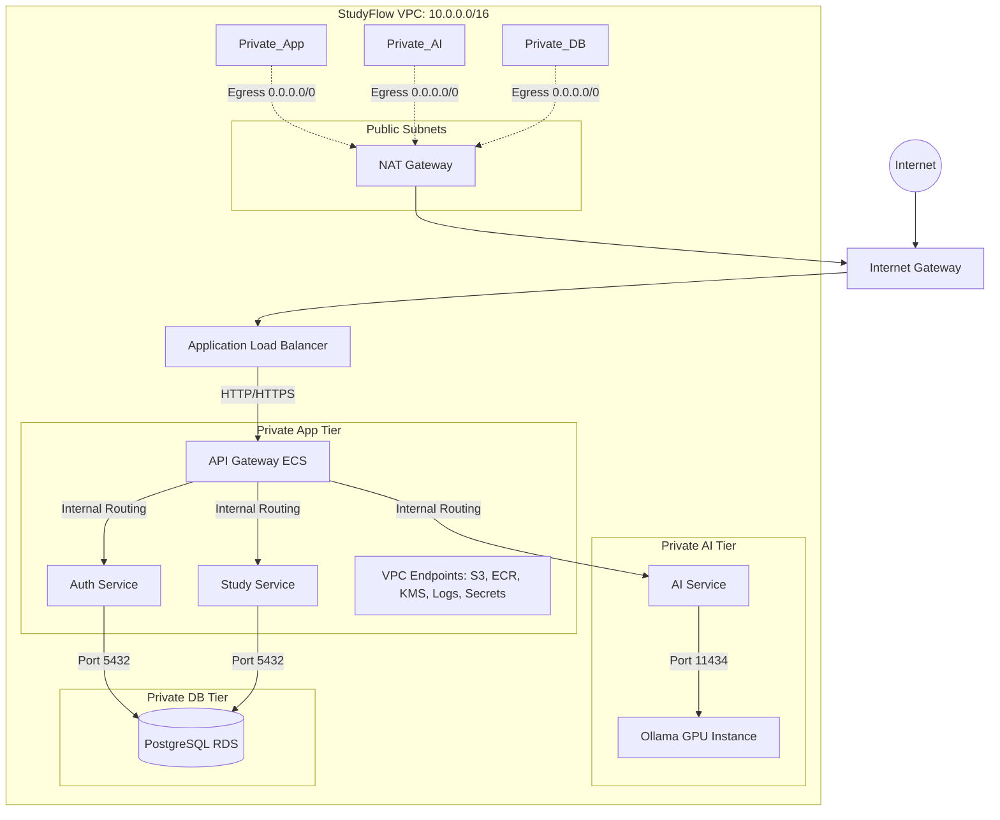

# StudyFlow AI Terraform Infrastructure

This directory contains the Infrastructure as Code (IaC) for StudyFlow AI, provisioned using Terraform.

## Architecture Diagram

## CIDR Allocation

| Tier | Subnet A | Subnet B | Description |
| :--- | :--- | :--- | :--- |
| **VPC** | `10.0.0.0/16` | | Main VPC CIDR |
| **Public** | `10.0.1.0/24` | `10.0.2.0/24` | Public-facing resources (ALB, NAT Gateways) |
| **Private App** | `10.0.3.0/24` | `10.0.4.0/24` | Core ECS Services (API, Auth, Study) |
| **Private DB** | `10.0.5.0/24` | `10.0.6.0/24` | PostgreSQL RDS (Private Only) |
| **Private AI** | `10.0.7.0/24` | `10.0.8.0/24` | AI Inference Services & GPU EC2 |

## Security Group Relationships

A strict pathing policy is enforced via Security Groups:

1. **ALB SG**: Allows Inbound HTTP/HTTPS from `0.0.0.0/0`.
2. **Gateway SG**: Allows Inbound HTTP ONLY from ALB SG.
3. **Service SG**: Allows Inbound TCP (8080, 8001, 8002) ONLY from Gateway SG, and permits internal inter-service communication.
4. **Database SG**: Allows Inbound PostgreSQL (5432) ONLY from Service SG.
5. **AI SG (GPU)**: Allows Inbound Ollama API (11434) ONLY from Service SG.
6. **VPC Endpoints SG**: Allows Inbound HTTPS (443) from the VPC CIDR `10.0.0.0/16`.

## Route Table Design

Route tables are heavily segmented to allow fine-grained access control across tiers:
* **Public Route Table**: Routes `0.0.0.0/0` to the Internet Gateway.
* **Private App Route Table**: Routes `0.0.0.0/0` to the NAT Gateway. Contains S3 Gateway Endpoint prefix list.
* **Private Database Route Table**: Routes `0.0.0.0/0` to the NAT Gateway. Contains S3 Gateway Endpoint prefix list.
* **Private AI Route Table**: Routes `0.0.0.0/0` to the NAT Gateway. Contains S3 Gateway Endpoint prefix list.

*Note: The segmentation allows future hardening (e.g. removing the NAT Gateway route entirely from the Database tier without affecting the App tier).*

## Environments: Dev vs. Production

To balance cost and high availability, the following architectural differences are applied between environments:

| Feature | `dev` | `prod` | Impact |
| :--- | :--- | :--- | :--- |
| **NAT Gateways** | 1 (Shared) | 2 (Per-AZ) | Saves ~$40/month in dev, ensures High Availability in prod. |
| **Interface Endpoints** | `false` | `true` | Saves ~$32/month in dev by routing traffic through NAT. Prod keeps all AWS traffic inside the VPC backbone. |
| **S3 Gateway Endpoint** | `true` | `true` | Gateway endpoints are free and utilized in both environments. |
| **VPC Flow Logs** | Optional | Optional | Configurable retention periods for observability. |

## Deployment Pipeline

1. **Bootstrap (`/bootstrap`)**: Run once per AWS account to provision S3 State backend and DynamoDB locking.
2. **Networking (`/modules/networking`)**: Run via environment layers to provision VPC, Subnets, Endpoints, and Route Tables.
3. **Security (`/modules/security`)**: Provision all isolated Security Groups.
